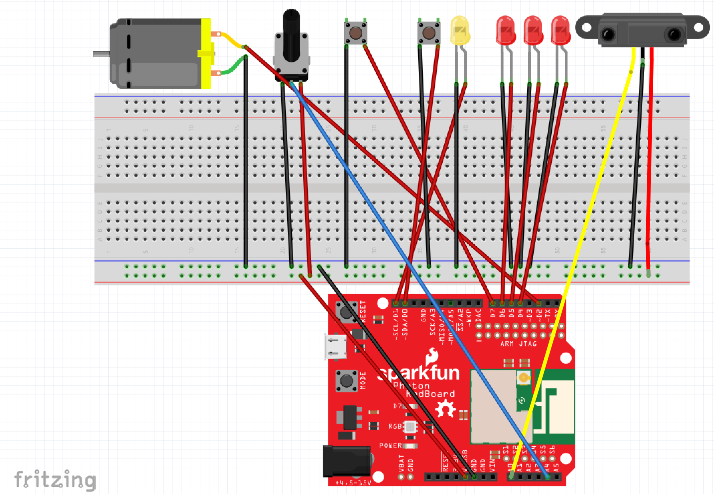

# Final Project - Physical Computing and the Internet of Things

*Name: Jo (Joungwon) Kwon

*Date: December 13, 2017

## Project:  Data Go Energy Go

< 2 - 3 sentence brief description / abstract of your project>

### Detailed Project Description

< Explain the "what" of your project:   What is it?   What does it do?   Explain the "why" of your project:  What problem is it responding to?  What issue is it engaging?   

### Technical Description

< Explain the "how" of your project.  What are the hardware components?  What are the software components?  How do they interact with each other? >

< You can also explain the development process here >


#### Hardware Wiring Diagram


// Servo motor(Sun comes up)
Servo myservo;  // create servo object to control a servo
int potpin = A4;  // A4 analog pin used to connect the potentiometer
int val;    // variable to read the value from the analog pin
int mappedVal; // mapped value for servo

// InfraIR(Sun to Apple)
int sensorPin = A0; //Anologue
SharpIR SharpIR(ir, model);
float reading;
int dist_cm;

// ButtonLED(Pikachu eats Apple)
int buttonPin1 = D7;

// ButtonLED(Thunder bolt)
int ledPin = D1;
int buttonPin2 = D0;//pepper button

// HTML(On Going)
int page = 1; //starts with 1.html

void setup(){
    Serial.begin(9600);
// HTML
    Particle.variable("page", page);
// Servo motor  
    myservo.attach(D2);  // attaches the servo on D2 to the servo object
// InfraIR
   for(int i=4; i<7; i++){
        pinMode(i, OUTPUT); //D4, D5, D6
    }
// ButtonLED(Pikachu eats Apple)
    pinMode(buttonPin1, INPUT_PULLUP);

// ButtonLED(Thunder bolt)
  pinMode(buttonPin2, INPUT_PULLUP); 
  pinMode(ledPin, OUTPUT); 
  pinMode(potpin, INPUT);
}

#### Code

< Explain your code.  You might include code snippets, either `inline` or
```c++
//Multiline
bool photon_fun = TRUE;
```
You should link to your full code, either included in the repository (e.g. [my_code.ino](code/my_code.ino)  or to the Shared Revision in your Particle IDE. >


### Design / Form

< Explain the device's form, the aesthetic choices made and how they relate to the concept/function the device is intended to engage >

< include photos of your device >

### Evaluation / Reflection

< What is your own evaluation of your project?   What did you learn through this project?  What would you do differently in the future? >
