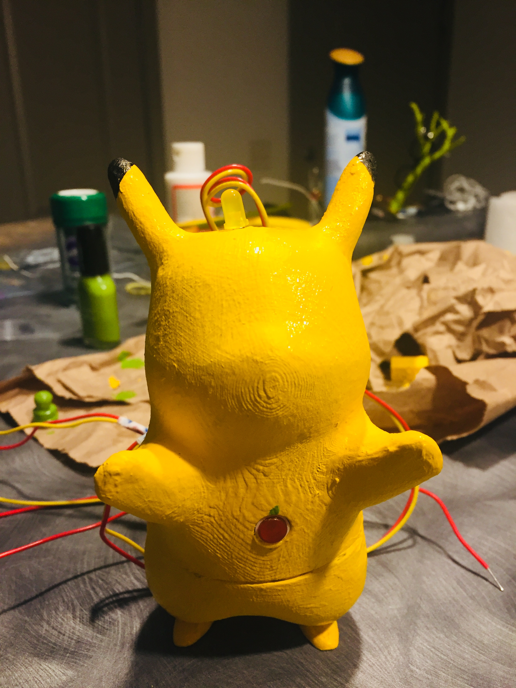
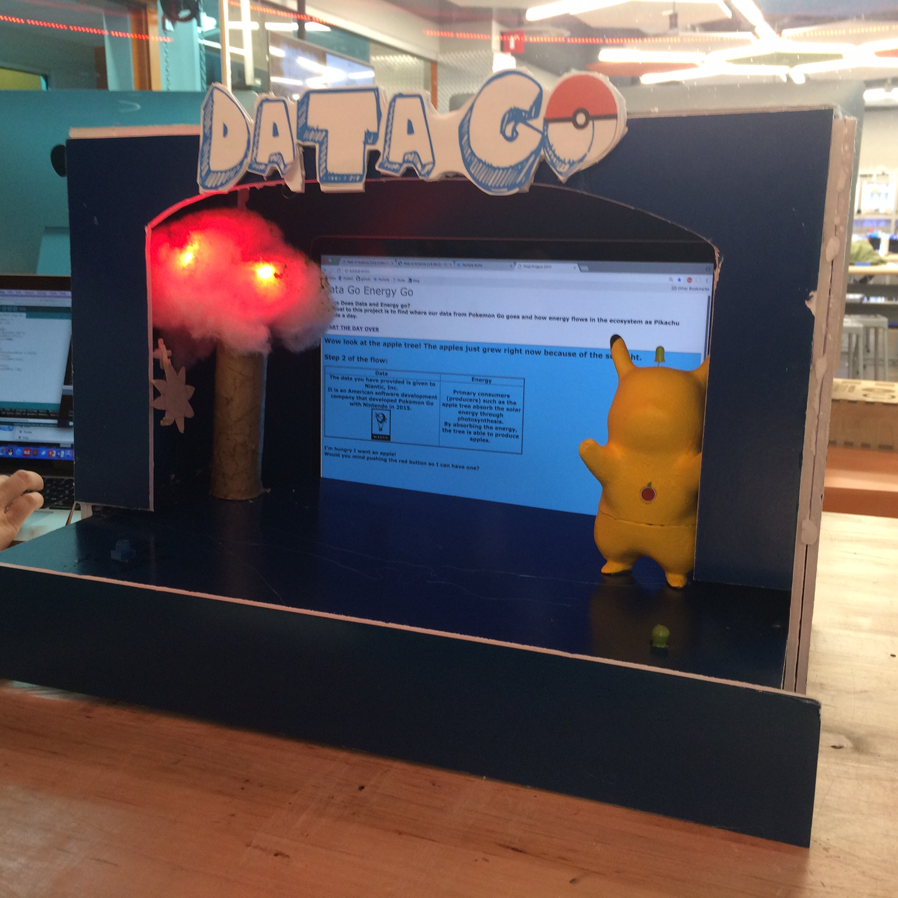
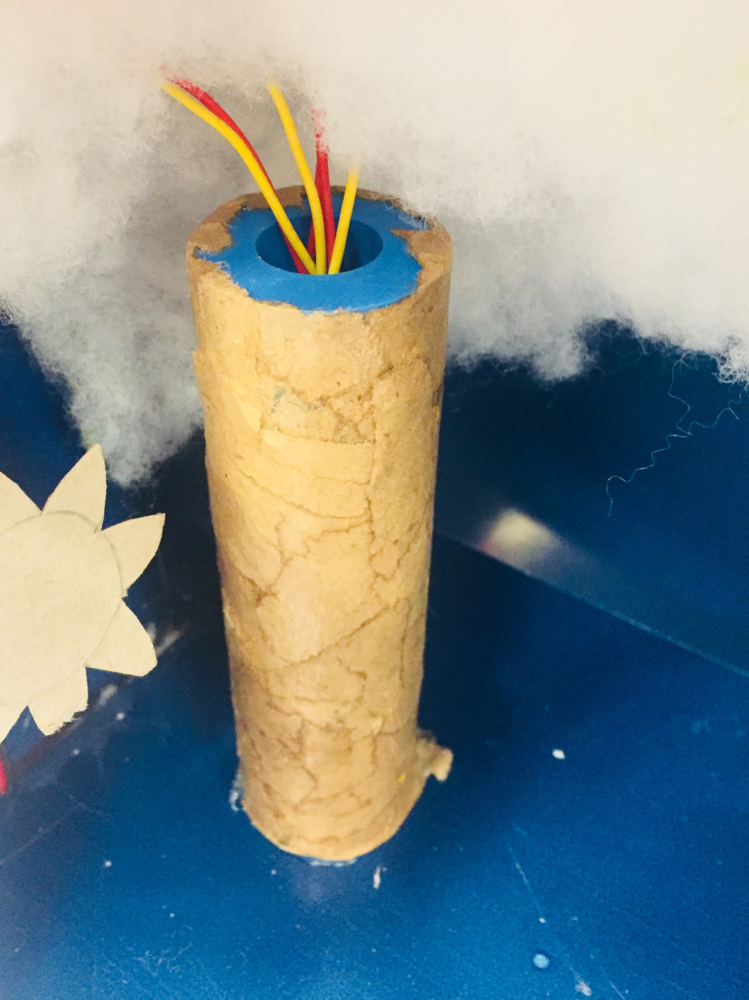

# Final Project - Physical Computing and the Internet of Things

*Name: Jo (Joungwon) Kwon

*Date: December 13, 2017

## Project:  Data Go Energy Go

< 2 - 3 sentence brief description / abstract of your project>

### Detailed Project Description

< Explain the "what" of your project:   What is it?   What does it do?   Explain the "why" of your project:  What problem is it responding to?  What issue is it engaging?   

### Technical Description

< Explain the "how" of your project.  What are the hardware components?  What are the software components?  How do they interact with each other? >

< You can also explain the development process here >


#### Hardware Wiring Diagram


Description
1. Potentiometer connected to A4 analog pin
2. Infrared Sensor conneted to A0
3. Yellow LED is connected to D1
4 Red LEDs are connected to D4, D5, D6
5. Button pin is connected to D7
6. Button pin2 is connected to D0


// HTML(On Going)
int page = 1; //starts with 1.html

void setup(){
    Serial.begin(9600);
// HTML
    Particle.variable("page", page);
// Servo motor  
    myservo.attach(D2);  // attaches the servo on D2 to the servo object
// InfraIR
   for(int i=4; i<7; i++){
        pinMode(i, OUTPUT); //D4, D5, D6
    }
// ButtonLED(Pikachu eats Apple)
    pinMode(buttonPin1, INPUT_PULLUP);

// ButtonLED(Thunder bolt)
  pinMode(buttonPin2, INPUT_PULLUP); 
  pinMode(ledPin, OUTPUT); 
  pinMode(potpin, INPUT);
}

#### Code

1. Define values (I worked on infrared sensor, the two buttons for changing the pages, and javascript for changing the pages)
```c++
// Servo motor(Sun comes up)
Servo myservo;  // create servo object to control a servo
int potpin = A4;  // A4 analog pin used to connect the potentiometer
int val;    // variable to read the value from the analog pin
int mappedVal; // mapped value for servo

// ButtonLED(Pikachu eats Apple)
int buttonPin1 = D7;

// ButtonLED(Thunder bolt)
int ledPin = D1;
int buttonPin2 = D0;//pepper button

// HTML(On Going)
int page = 1; //starts with 1.html
```
2. Setup the functions 
```c++
void setup(){
    Serial.begin(9600);
// HTML
    Particle.variable("page", page);

// InfraIR
   for(int i=4; i<7; i++){
        pinMode(i, OUTPUT); //D4, D5, D6
    }
// ButtonLED(Pikachu eats Apple)
    pinMode(buttonPin1, INPUT_PULLUP);

// ButtonLED(Thunder bolt)
    pinMode(buttonPin2, INPUT_PULLUP); 
    pinMode(ledPin, OUTPUT); 
    pinMode(potpin, INPUT);
}
```
3. How the function works?
```c++
void loop()
{
    Serial.print("Page: ");
    Serial.println(page);
    // servo motor
    val = analogRead(potpin);            // reads the value of the potentiometer (value between 0 and 1023)
    Serial.println(val);
    mappedVal = map(val, 0, 4095, 0, 180);     // scale it to use it with the servo (value between 0 and 180)
    myservo.write(mappedVal);                  // sets the servo position according to the scaled value
    delay(15);                           // waits for the servo to get there

    if(val >= 5  && val < 500)
    {
        page=2;//html
    } //change to page 2
    
    if(val >= 500 && val < 1000)
    {
        page=3;//html
    } //change to page 3 when the value is between these two numbers
    // InfraIR
    reading = analogRead(sensorPin); //read the sensorPin
    int dist_cm = SharpIR.distance();  
        
    if(dist_cm>=0 && dist_cm<11) //read when less then 11cm
    {
        for(int i=4; i<7; i++)
        {
            digitalWrite(i, HIGH); //all lights are ON 
        }
        Particle.publish("light_status", "less than 10cm");
    }
    else
    {
        for(int i=4; i<7; i++)
        {
            digitalWrite(i, LOW); //D4, D5, D6 is OFF
        }
    }
    delay(50);
    
    //Button change page
    int buttonState1 = digitalRead(buttonPin1);
    if(buttonState1 == LOW)
    {
        page=4; //html
    }//change to page 4
    
    //ButtonLED (thunder)
    int buttonState2 = digitalRead(buttonPin2);
    if(buttonState2 == LOW)
    {
        digitalWrite(ledPin, HIGH);
        page=5; //html
    }else
    {
        digitalWrite(ledPin, LOW);
    }//change to page 5 when button is pressed
    
    //potentionmeter state sun down
    if(val>=3000)    
    {
        page=6; //html
    }//change to page 6
}
```
[my_code.ino](code/my_code.ino)

4. Javascript and p5js codes
In order to show Pikachu's data is given to many entities, I used p5js to visualize Pikachu's love for apples.
```javascript
<html>
	<head>
	    <meta charset="UTF-8">
		<title>Final Project 2017</title>
		<script
            src="https://code.jquery.com/jquery-3.2.1.min.js"
            integrity="sha256-hwg4gsxgFZhOsEEamdOYGBf13FyQuiTwlAQgxVSNgt4="
            crossorigin="anonymous">
        </script>
        <style>
        body {
            background-color: white;
        }
        </style>
	</head>
	<body>
	<font face="Verdana" color="666666" size="14">
		Data Go Energy Go<br>
        </font>
		<font face="Verdana" color="000000">
		<h2>
        Where Does Data and Energy go?<br>
        The goal to this project is to find where our data from Pokemon Go goes and how energy flows in the ecosystem as Pikachu spends a day.
		<br>
        <br>
		<a href="1.html" target="bottom">START THE DAY OVER</a></h2></font>
		<iframe width="100%" height= "95%" src="1.html" name="bottom"></iframe> 
	   <script type="text/javascript">
        var deviceID    = "430053001151353338363333";
        var accessToken = "9fe41d708a5453d5b7edbd576398dd6afaf9ef4f";
        var var2get = "page";
        var lastPage = 0; // set both to zero for starting
        var newPage = 0; 

        function check4pageTurn() {
            var requestURL = "https://api.particle.io/v1/devices/" +deviceID + "/" + var2get + "/?access_token=" + accessToken;
            $.getJSON(requestURL, function(json) {
                newPage = json.result;
                if (newPage != lastPage){
                    swapFrame(newPage);
                }
            });
            lastPage = newPage;
        }

        function swapFrame(page) {
            console.log("Changed page to " + page);
            self.frames['bottom'].location.href = page + '.html';
        } 
        setInterval(check4pageTurn, 500);
    </script>
	</body>
</html>
```

'''javascript
<html>
	<head>
		<title>Step 5</title>
		<script type="text/javascript" src="./p5.js"></script>
		<script type="text/javascript" src="./rain_sketch2.js"></script>
		<script type="text/javascript" src="./rain.js"></script>
	</head>
	<body bgcolor="#03A9F4">
		<font face="Verdana" color="#33333">
		<div id="sketch"></div>
		<h1>Oh no...Everyone seems to know that I love apples. Why am I getting emails about Apple's products? 
		
		<br>
		<br>
		MAKE A CHOICE TODAY!<br>
		To remove your personal information, log into 
		<a href="http://support.pokemon.com">support.pokemon.com</a> and submit a customer service request, or contact The Pokemon Company International, Inc.<br>
		</h1>
		</font>
	</body>
</html>
'''

### Design / Form

< Explain the device's form, the aesthetic choices made and how they relate to the concept/function the device is intended to engage >



[Pikachu Model] https://www.thingiverse.com/thing:670032

The tree was designed in Fusion and modgepodged with brown paper. Cotton was added to hide the red LED lights and to look like a tree.

### Evaluation / Reflection

< What is your own evaluation of your project?   What did you learn through this project?  What would you do differently in the future? >
